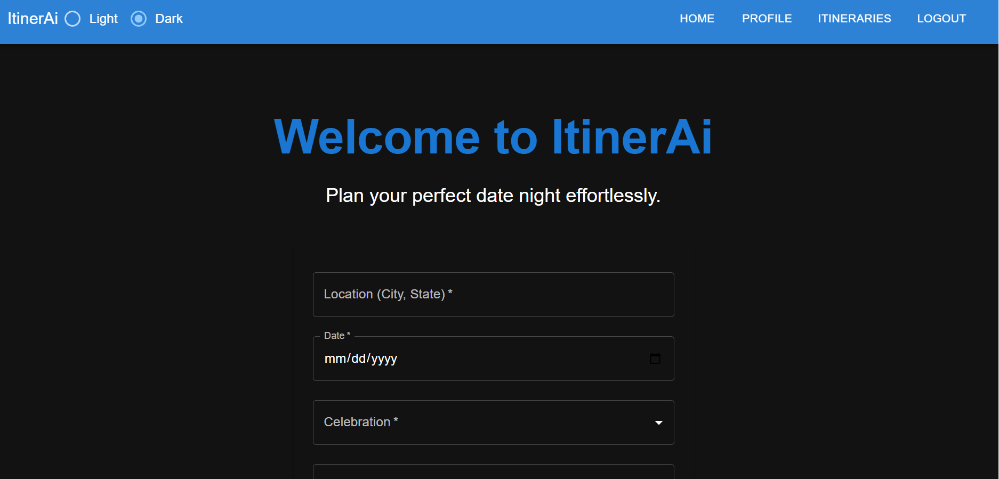
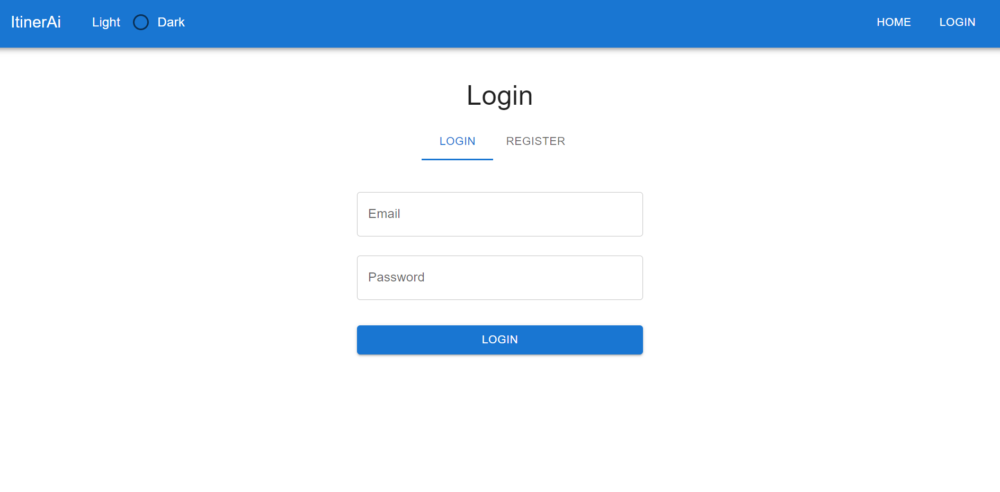
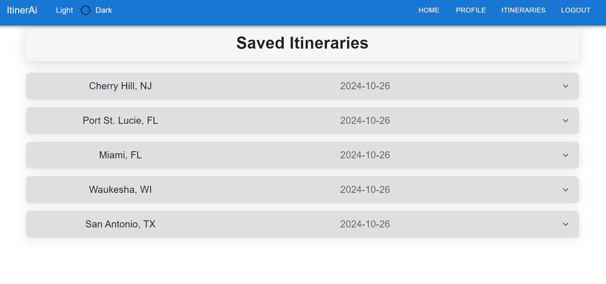
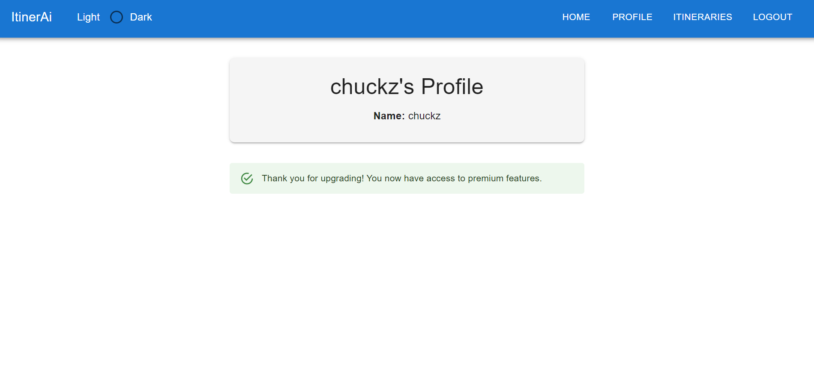

# ItinerAi

## Description

ItinerAi is a date night planning application designed to create personalized itineraries based on user preferences like location, special occasions, interests, and dining preferences. The app simplifies the planning process by generating multiple options, helping users save time and effort while ensuring memorable experiences. Built using React for the frontend, GraphQL with Node.js and Express.js for the backend, and MongoDB for the database, ItinerAi integrates OpenAI for intelligent itinerary suggestions and Stripe for payment processing, allowing users to access premium features such as saving itineraries. Authentication is handled with JWT for secure user management, providing an intuitive and seamless user experience.

## Screenshots

*Home Page*

*Login/ Register Page*

*Save An Itinerary*

*Update A User*

## Table of Contents

- [Installation](#installation)
- [Usage](#usage)
- [Contributing](#contributing)
- [Tests](#tests)
- [Questions](#questions)
- [License](#license)

## Installation

To install ItinerAi locally, start by cloning the repository from GitHub. Navigate to the project directory and run `npm install` to install all required dependencies. Make sure you have Node.js and MongoDB installed on your system. Next, create a `.env` file in the root directory and provide necessary environment variables such as your MongoDB URI, Stripe API keys, and JWT secret. To start the development server, run `npm run develop`. The application should now be accessible in your browser at `http://localhost:3000`.

## Usage

ItinerAi offers a seamless and intuitive experience for users looking to plan the perfect date night. To get started, users need to create an account or log in if they already have one. Once logged in, they can fill out a simple questionnaire detailing their location, planned date, interests, food preferences, and any special occasions they might be celebrating. The app then generates multiple personalized itinerary options based on their responses. Users can choose to upgrade their account through a Stripe-powered payment system to unlock premium features, including the ability to save and revisit itineraries for future planning.

## Contributing

Contributions to ItinerAi are welcome and encouraged! To contribute, please fork the repository and create a new branch for your feature or bug fix. Ensure that your code follows best practices and is well-documented. Before submitting a pull request, run the existing test suite using `npm test` and confirm that all tests pass. If you’re adding new features, please write appropriate tests to maintain code coverage. Once your changes are complete, open a pull request with a detailed explanation of your modifications. We appreciate your contributions and will review pull requests as quickly as possible!

## Tests

To test the ItinerAi application using GraphQL, start by ensuring your development environment is properly set up and the necessary dependencies are installed. You can use tools like Apollo Server's testing utilities or Postman/Insomnia for manual testing. Begin by testing the GraphQL API endpoints: make requests for queries and mutations such as `getUser`, `createItinerary`, or `updateUser` to confirm they return the expected data or perform the correct operations. Ensure you provide valid inputs and test edge cases, like missing or invalid fields, to verify error handling. Automated testing can be set up using a test framework like Mocha or Chai, combined with supertest, to simulate requests to the GraphQL server. Run your tests using `npm test` to confirm that all endpoints and logic function correctly within the API.

## Questions

If you have any questions, please feel free to contact any of our team members:
- Charles DeMichele: [demichele.charles@gmail.com](mailto:demichele.charles@gmail.com) | GitHub: [demichele-c](https://github.com/demichele-c)
- Cassidy Pagels: [rozeneclipse@gmail.com](mailto:rozeneclipse@gmail.com) | GitHub: [Mieruru](https://github.com/Mieruru)
- Richard Strain: [richardstrain@gmail.com](mailto:richardstrain@gmail.com) | GitHub: [rich-strain](https://github.com/rich-strain)
- David Villarreal: [davidvillarr3al@gmail.com](mailto:davidvillarr3al@gmail.com) | GitHub: [davidVillarreal03](https://github.com/davidVillarreal03)

## License

This project is licensed under the MIT license. Click [here](https://opensource.org/licenses/MIT) for more details.
